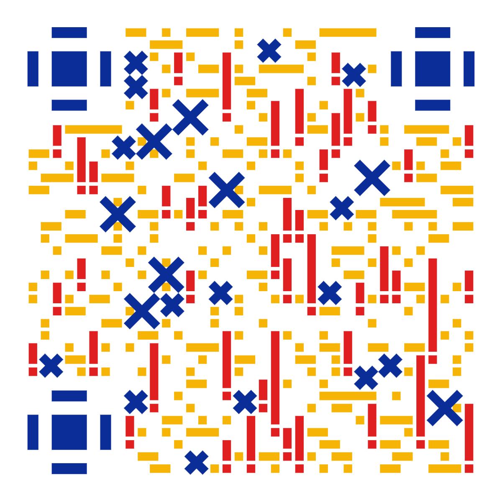

# FundLink | 一基暴富 📈

[](https://flutter.dev)
[](LICENSE)
[]()

面向理财经理与个人投资者的跨平台基金持仓管理工具，支持多客户、多基金、多笔交易的穿透式管理与分析。

---

## ✨ 核心功能

### 📊 持仓与交易管理
- **多客户持仓**：按客户分组管理基金持仓，支持拼音排序、置顶、搜索
- **交易流水**：记录每笔买入/卖出，自动计算加权平均成本与持有份额
- **待确认交易**：自动识别 15:00 后及非交易日交易，标记 T+1/T+2 确认状态，支持手动确认与自动重试
- **加仓/减仓**：同一客户同一基金支持多次操作，合并计算收益

### 💰 收益计算
- **绝对收益**：当前市值 - 累计投入，实时反映盈亏
- **年化收益率**：基于持有天数的年化换算
- **多维度排名**：按金额 / 收益 / 收益率 / 持有天数排序，支持升降序
- **实时估值**：交易时段自动刷新基金盘中估算净值，可配置刷新间隔（1/3/5 分钟）

### 📈 数据分析
- **基金业绩走势**：历史净值折线图，支持同类平均 / 沪深300 基准对比
- **十大重仓股**：穿透展示基金前十大持仓股票及占比
- **投资组合分析**：
  - 投资金额饼图（集成盈亏着色）
  - 加权重仓股汇总（含市场标签、覆盖基金数）
  - 风格分布（大盘/中盘/小盘 × 价值/成长）
  - 行业分布（Top3 高亮 + 百分比）
  - 重叠检测（多基金共持股票，含 PE/PB/市值）
- **股票行情**：A 股 / 港股实时行情查询，含 K 线蜡烛图（日/周/月K）、PE/PB/市值数据
- **行业分类**：三层降级策略（API 数据 → 600+ 只精确映射 → 关键词匹配）

### 📥 数据导入
- **格式支持**：CSV / Excel（.xlsx / .xls）
- **编码兼容**：UTF-8（含 BOM）/ GBK / Latin1 自动检测
- **模糊匹配**：智能识别列映射关系，支持手动调整
- **三种模式**：
  - 持仓数据导入（客户名、基金代码、金额/份额/日期）
  - 映射词典导入（客户号 ↔ 客户名）
  - 完整备份还原（持仓 + 交易流水）
- **拖拽导入**：桌面端支持拖放文件直接导入
- **模板下载**：一键下载标准导入模板

### 📤 数据导出
- **格式支持**：CSV / Excel
- **完整备份**：导出全部持仓 + 交易流水，含版本元数据
- **自定义导出**：20+ 字段自由组合，支持按基金代码、金额、收益率筛选
- **分享**：通过系统分享面板发送到其他应用

### 🔒 安全与隐私
- **隐私模式**：一键脱敏客户姓名，安全截屏转发
- **本地存储**：SQLite 数据库，数据完全离线，不经第三方服务器
- **输入加固**：文件大小限制（5MB）、字段长度限制、错误信息脱敏

### 🎨 用户体验
- **跨平台**：iOS / Android / Windows / macOS / Linux / Web
- **深色模式**：浅色 / 深色 / 跟随系统三种主题
- **响应式布局**：自适应手机、平板、桌面端
- **Cupertino 风格**：iOS 原生设计语言，磨玻璃效果
- **动画交互**：排序动画、页面切换、呼吸灯价格效果
- **智能缓存**：TTL + LRU 多级缓存，流畅体验

---

## 🚀 快速开始

### 环境要求

- Flutter SDK >= 3.0.0
- Dart SDK >= 3.0.0

### 安装运行

```bash
git clone https://github.com/rizona27/fundlink.git
cd fundlink
flutter pub get
flutter run
```

### 构建发布

```bash
flutter build apk --release     # Android
flutter build ios --release     # iOS
flutter build windows --release # Windows
flutter build macos --release   # macOS
```

---

## 🛠 技术栈

| 层级 | 技术选型 |
|------|---------|
| 框架 | Flutter 3.x + Dart |
| 本地存储 | SQLite（sqflite / sqflite_common_ffi） |
| 状态管理 | ChangeNotifier + InheritedWidget |
| 网络请求 | http + 自定义连接池（连接复用、重试、退避） |
| 图表 | fl_chart |
| 文件处理 | excel, csv, archive |
| 平台能力 | desktop_drop, file_picker, share_plus, url_launcher, permission_handler, gal, receive_sharing_intent |
| 工具库 | uuid, pinyin, fast_gbk, world_holidays, mime, package_info_plus |

---

## 📁 项目结构

```
lib/
├── main.dart                              # 应用入口，主题配置与路由
├── constants/
│   └── app_constants.dart                 # 全局常量（API 地址、缓存 TTL、业务规则）
├── data/
│   └── industry_classification.dart        # 600+ 只股票代码→行业精确映射表
├── models/
│   ├── client_mapping.dart                # 客户号↔客户名映射模型
│   ├── fund_holding.dart                  # 基金持仓模型
│   ├── fund_info_cache.dart               # 基金信息本地缓存模型
│   ├── log_entry.dart                     # 日志条目模型
│   ├── net_worth_point.dart               # 净值数据点模型
│   ├── profit_result.dart                 # 收益计算结果模型
│   ├── top_holding.dart                   # 十大重仓股模型
│   ├── transaction_record.dart            # 交易记录模型
│   └── weighted_holding.dart              # 加权重仓股模型
├── services/
│   ├── data_manager.dart                  # 数据中心门面，聚合持仓/交易/日志/设置/估值
│   ├── database_helper.dart               # SQLite 跨平台数据库
│   ├── database_repository.dart           # 数据访问层封装
│   ├── fund_service.dart                  # 基金 API（净值、排名、重仓股、基准对比）
│   ├── stock_quote_service.dart           # 腾讯行情 API，批量获取 A 股/港股实时行情
│   ├── file_import_service.dart           # 智能导入（CSV/Excel，编码检测，模糊匹配）
│   ├── file_export_service.dart           # 自定义导出（CSV/Excel，20+ 字段可选）
│   ├── china_trading_day_service.dart      # 中国交易日判断（含节假日与调休）
│   ├── industry_classifier.dart           # 行业分类（API→精确映射→关键词 三层降级）
│   ├── client_mapping_service.dart        # 客户映射词典管理
│   ├── transaction_utils.dart             # 交易日/确认日/NAV 日期计算
│   ├── valuation_notifier.dart            # 实时估值缓存与批量刷新
│   ├── log_notifier.dart                  # 操作日志管理
│   ├── settings_notifier.dart             # 用户偏好设置（主题/隐私/显示）
│   ├── http_client_provider.dart          # HTTP 连接池复用
│   ├── ui_state_service.dart              # UI 状态持久化（展开/折叠/排序）
│   └── version_check_service.dart         # 版本检查与更新通知
├── utils/
│   ├── animation_config.dart              # 动画时长与曲线统一配置
│   ├── desktop_focus_manager.dart         # 桌面端 Tab 键焦点导航
│   ├── error_handler.dart                 # 统一错误捕获与友好提示
│   ├── input_formatters.dart              # 金额/份额/费率/客户名 输入格式化器
│   ├── memory_info_native.dart            # 原生平台内存监控
│   ├── memory_info_web.dart               # Web 平台内存监控
│   ├── memory_monitor.dart                # 跨平台内存监控门面
│   ├── permission_gate.dart               # 权限检查与授权引导
│   ├── smart_cache.dart                   # TTL + LRU 智能缓存
│   └── view_utils.dart                    # 日期/数字 格式化辅助函数
├── views/
│   ├── splash_view.dart                   # 启动页
│   ├── summary_view.dart                  # 基金一览（分组/排序/实时估值/搜索）
│   ├── client_view.dart                   # 客户持仓（拼音排序/置顶/搜索/批量操作）
│   ├── client_fund_summary_view.dart       # 投资组合深度分析（饼图/风格/行业/重叠）
│   ├── top_performers_view.dart           # 业绩排名（金额/收益/收益率/天数 多维排序）
│   ├── fund_detail_view.dart              # 基金详情（净值走势/基准对比/重仓股/K线）
│   ├── add_holding_view.dart              # 新增持仓（表单/日期选择/重复检测）
│   ├── edit_holding_view.dart             # 编辑持仓（加仓/减仓/交易历史）
│   ├── manage_holdings_view.dart          # 持仓管理（批量编辑/删除）
│   ├── pending_transactions_view.dart     # 待确认交易队列（自动/手动确认）
│   ├── import_holding_view.dart           # 数据导入向导（文件选择→字段映射→校验）
│   ├── export_holding_view.dart           # 数据导出向导（格式→字段→结果）
│   ├── config_view.dart                   # 设置页（持仓管理/数据同步/偏好/关于）
│   ├── mapping_dictionary_view.dart       # 客户映射词典管理
│   ├── history_view.dart                  # 历史净值弹窗
│   ├── log_view.dart                      # 系统日志查看
│   ├── license_view.dart                  # 开源协议（AGPL v3）
│   ├── permission_settings_view.dart      # 权限许可管理
│   └── version_view.dart                  # 版本信息与更新日志
├── widgets/
│   ├── adaptive_top_bar.dart              # 自适应顶栏（刷新/搜索/筛选）
│   ├── add_transaction_dialog.dart        # 加仓/减仓对话框
│   ├── batch_rename_dialog.dart           # 批量编辑客户信息
│   ├── countdown_refresh_button.dart      # 倒计时刷新按钮
│   ├── custom_fund_config_dialog.dart     # 自定义基金配置
│   ├── empty_state.dart                   # 空数据占位组件
│   ├── error_boundary.dart                # 错误边界组件
│   ├── floating_tab_bar.dart              # 浮动底部导航栏
│   ├── fund_card.dart                     # 基金卡片（净值/收益/收益率）
│   ├── fund_performance_chart.dart        # 基金业绩走势折线图
│   ├── fund_performance_dialog.dart       # 多周期业绩弹窗
│   ├── glass_button.dart                  # 磨玻璃风格按钮
│   ├── gradient_card.dart                 # 渐变卡片（分组标题）
│   ├── page_scroll_to_top.dart            # 回到顶部按钮（平滑滚动/淡入淡出）
│   ├── paginated_list_view.dart           # 分页懒加载列表
│   ├── refresh_button.dart                # 通用刷新按钮
│   ├── search.dart                        # 防抖搜索栏
│   ├── stock_candle_chart.dart            # K 线蜡烛图（日/周/月 K）
│   ├── stock_chart_widget.dart            # 股票图表容器（K 线 + 成交量）
│   ├── stock_detail_dialog.dart           # 股票详情弹窗（实时行情/呼吸灯）
│   ├── theme_switch.dart                  # 主题切换（药丸滑动开关）
│   ├── toast.dart                         # 全局 Toast 提示
│   ├── top_holdings_widget.dart           # 十大重仓股展示
│   ├── transaction_history_dialog.dart    # 交易历史弹窗
│   └── update_dialog.dart                 # 版本更新提示
└── mixins/
    └── scroll_to_top_mixin.dart           # 回到顶部混入
```

---

## ⚖️ 开源协议

本项目采用 **GNU Affero General Public License v3.0 (AGPL-3.0)** 协议。详见 [LICENSE](LICENSE)。

### 免责声明

- 本项目仅供**个人学习**与**技术交流**使用，不得用于任何商业用途。
- 所有数据及计算结果均来自公开网络接口，**不保证其准确性、完整性或及时性**。
- 本项目提供的信息**不构成任何投资建议**。
- 请在遵守相关法律法规及数据源服务条款的前提下使用。

---

## ☕ 支持本项目



> 如果对你有所帮助，欢迎微信扫码请开发者喝杯柠檬水 ～☕

---

**FundLink** — 让每一份资产波动都尽在掌握。

Designed with ❤️ for Finance Professionals.
