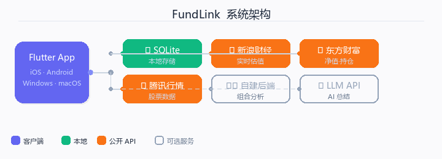

# FundLink — 基金持仓管理工具 📈

  
  
  
  

  <b>面向基金管理的跨平台客户持仓工具</b> 
  多客户 · 多基金 · 多笔交易 · 穿透式管理与分析

---

## 🏗️ 架构

  

---

## ✨ 核心功能

### 📊 持仓与交易管理
- **多客户持仓**：按客户分组管理基金持仓，支持拼音排序、置顶、搜索
- **交易流水**：记录每笔买入/卖出，自动计算加权平均成本与持有份额
- **待确认交易**：自动识别 15:00 后及非交易日交易，标记确认状态
- **加仓/减仓**：同一客户同一基金支持多次操作，合并计算收益

### 💰 收益计算
- **绝对收益**：当前市值 − 累计投入，实时反映盈亏
- **年化收益率**：基于持有天数的年化换算
- **多维度排名**：按金额 / 收益 / 收益率排序
- **实时估值**：新浪财经 + 自建后端双源估值，支持盘中自动刷新

### 📈 数据分析
- **基金业绩走势**：历史净值折线图，支持同类平均 / 沪深300 对比
- **十大重仓股**：穿透展示基金前十大持仓股票及占比
- **投资组合分析**：金额饼图、重仓股汇总、风格分布、行业分布、重叠检测
- **股票行情**：A 股实时行情，含 K 线蜡烛图、PE/PB/市值数据
- **AI 智能总结**：直连用户自有 LLM，一键生成分析报告

### 📥 数据导入 / 📤 数据导出
- CSV / Excel 格式支持，编码自动检测，模糊列匹配
- 三种模式：持仓数据 / 映射词典 / 完整备份
- 自定义导出：20+ 字段自由组合，支持筛选

### 🔒 安全与隐私
- **本地存储**：SQLite 数据库，数据完全离线
- **隐私模式**：一键脱敏客户姓名
- **AI 直连**：LLM 调用从客户端直连，不经过任何中间服务器

### 🎨 用户体验
- iOS / Android / Windows / macOS 全平台
- 浅色 / 深色 / 跟随系统主题
- Cupertino 设计语言，原生动画交互

---

## ⚡ 功能依赖

| 功能 | 是否需要后端 | 是否需要 AI Key | 数据来源 |
|------|:---:|:---:|------|
| 持仓管理 / 交易流水 | — | — | 本地 SQLite |
| 数据导入 / 导出 | — | — | 本地文件 |
| 基金净值 / 业绩走势 | — | — | 东方财富公开 API |
| 实时估值（新浪） | — | — | 新浪财经公开 API |
| 实时估值（后端自建） | ✅ 需要 | — | 自建后端模型 |
| 股票行情 / K 线 | — | — | 腾讯行情 / 东方财富 |
| 组合分析（批量重仓股 + 风格 + 行业） | ✅ 需要 | — | akshare（自建后端） |
| AI 智能总结 | — | ✅ 需要 | 用户自配 LLM Key |

> 💡 不配置后端和 AI Key 的情况下，可正常使用约 **85%** 的功能。

---

## 🚀 安装

从 [Releases](https://github.com/rizona27/fundlink/releases) 页面下载对应平台的最新版本：

- **iOS**：`.ipa` 文件，通过 AltStore / SideStore / 企业签名安装
- **Android**：`.apk` 文件，直接安装
- **Windows**：`.zip` 解压即用
- **macOS**：`.dmg` 拖入 Applications

---

## ❓ 常见问题

<b>Q: 我的数据安全吗？</b>

所有持仓数据存储在本地 SQLite 数据库中，不会上传到任何服务器。基金净值、股票行情等直接从公开 API 获取。

<b>Q: 不搭建后端能用吗？</b>

可以，约 85% 的功能无需后端。仅批量组合分析和后端自建估值模型需要。

<b>Q: 实时估值准确吗？</b>

实时估值基于基金公开持仓和指数行情估算，仅供盘中和排序参考。基金真实净值以基金公司官方公布数据为准。

---

## ☕ 支持本项目

  <table align="center">
    <tr>
      <td>
        
      </td>
      <td style="vertical-align: middle; padding-left: 20px;">
        <b>如果对你有所帮助，可以请我喝杯柠檬水喔～☕</b>
      </td>
    </tr>
  </table>

---

## ⚠️ 免责声明

> - 本工具仅供个人学习与技术交流使用
> - 所有数据及计算结果均来自公开网络接口，**不保证准确性、完整性或及时性**
> - 提供的信息**不构成任何投资建议**，投资有风险，入市需谨慎
> - 基金净值以基金公司官方公布数据为准，实时估值仅供参考

---

  <b>FundLink</b> — 让每一份资产波动都尽在掌握。 
  Designed with ❤️ for Finance Professionals.

