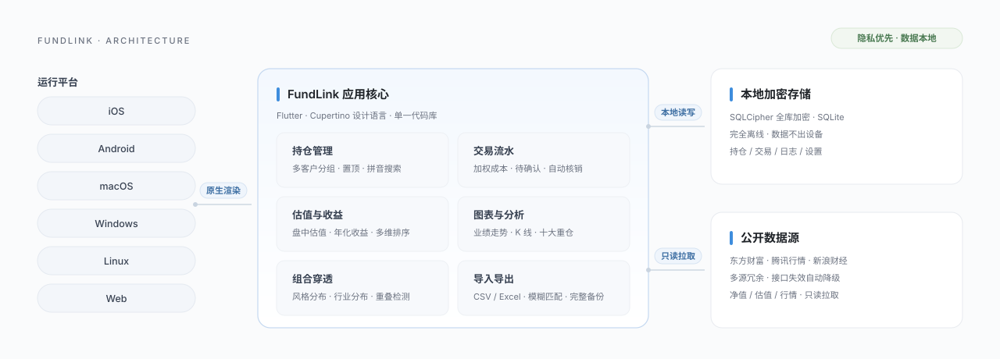

# FundLink — 基金持仓管理工具 

  
  
  
  

  <b>面向基金管理的跨平台客户持仓工具</b> 
  多客户 · 多基金 · 多笔交易 · 穿透式管理与分析

---

## 架构

  

**客户端优先**：持仓、交易、估值与图表全部在本地完成。所有业务数据存放于
SQLCipher 全库加密的 SQLite 数据库，完全离线、数据不出设备；行情与净值
按需从公开数据源（东方财富 / 腾讯行情 / 新浪财经）只读拉取，多源冗余、
接口失效自动降级。自研估值服务随真实净值自动校准与升级，无需人工干预。

---

## 核心功能

### 持仓与交易管理
- **多客户持仓**：按客户分组管理基金持仓，支持拼音排序、置顶、搜索
- **交易流水**：记录每笔买入/卖出，自动计算加权平均成本与持有份额
- **待确认交易**：自动识别 15:00 后及非交易日交易，支持自动/手动确认净值
- **加仓/减仓**：同一客户同一基金支持多次操作，合并计算收益
- **映射词典**：客户号  客户姓名自动匹配，批量重命名

### 估值与收益
- **绝对收益 / 年化收益率**：基于持有天数实时计算
- **多维度排名**：按金额 / 收益 / 收益率 / 持有天数 / 最新估值排序
- **聚合估值（多源融合）**：聚合 FVL 批量估值、新浪财经、腾讯行情等多个
  公开源的盘中估值，交叉校验、择优采信，单一接口失效自动降级到下一数据源
- **智能状态标识**：绿「净」（当日净值已公布）/ 蓝「净」（有净值但非最新交易日，
  如周更/定开基金）/ 灰「估」（盘中实时估值），多数据源自动降级

### 自研估值模型（可选）

<b>基于基金重仓股 + 指数行情 + OLS 回归校准的盘中估值模型 — 点击展开</b>

- **自动进化**：偏差自学习 / 阈值标定在线自校准，模型随真实净值自动升级，
  无需人工干预
- **任意基金**：支持任意场外基金，无需单独配置
- **每日精度报告**：与主流第三方源（新浪财经）在同一持仓样本上的每日
  误差对比（MAE / 方向准确率 / 命中率）自动生成、公开可查

### 数据分析
- **基金业绩走势**：历史净值折线图，支持同类平均 / 沪深300 / 中证500 / 中证1000 对比
- **十大重仓股**：穿透展示基金前十大持仓股票及占比
- **投资组合分析**：金额饼图、重仓股汇总、风格分布、行业分布、重叠检测
- **股票行情**：A 股实时行情，含 K 线蜡烛图、PE/PB/市值数据
- **AI 智能总结**：直连用户自有 LLM，一键生成分析报告（报告内容可自定义）

### 数据导入 / 数据导出
- CSV / Excel 格式支持，编码自动检测（UTF-8 / GBK），模糊列匹配
- 三种模式：持仓数据 / 映射词典 / 完整备份
- 自定义导出：20+ 字段自由组合、筛选、持有天数/收益率报告，CSV 带 BOM 兼容 Excel

### 安全与隐私
- **本地加密存储**：SQLCipher 全库加密的 SQLite 数据库，完全离线且防直接读取
- **隐私模式**：一键脱敏客户姓名
- **AI 直连**：LLM 调用从客户端直连，不经过任何中间服务器

### 用户体验
- iOS / Android / Windows / macOS / Linux / Web 全平台
- 浅色 / 深色 / 跟随系统主题；三档文字大小（小/标准/大）
- Cupertino 设计语言，原生动画交互；统一对话框 / 选择弹窗 / 错误视图 / 分步指示组件
- 桌面端双列布局（>1000px）、键盘快捷键（Cmd/Ctrl+F 搜索、R 刷新、Esc 收起）

---

## 功能依赖

| 功能 | 数据来源 |
|------|------|
| 持仓管理 / 交易流水 / 导入导出 | 本地数据库，完全离线 |
| 基金净值 / 业绩走势 | 东方财富公开 API |
| 股票行情 / K 线 | 腾讯行情 / 东方财富 |
| 聚合估值（多源融合） | 公开源多路聚合，自动降级 |
| 自研估值模型 / 组合穿透分析 | 自研服务（可选，附每日精度报告） |
| AI 智能总结 | 用户自配 LLM Key |

>  核心功能开箱即用；自研估值模型与组合穿透为可选增强，其余约 **85%** 的功能无需任何配置。

---

## 安装

从 [Releases](https://github.com/rizona27/fundlink/releases) 或应用内「版本检测」页面下载对应平台的最新版本：

- **iOS**：`.ipa` 文件，通过 AltStore / SideStore / 企业签名安装
- **Android**：`.apk` 文件，直接安装
- **Windows**：`.zip` 解压即用
- **macOS**：`.dmg` 拖入 Applications

## 常见问题

<b>Q: 我的数据安全吗？</b>

所有持仓数据存储在本地 SQLCipher 加密的 SQLite 数据库中，不会上传到任何服务器，直接读取数据库文件也无法查看内容。基金净值、股票行情等直接从公开 API 获取。

<b>Q: 不联网能用吗？</b>

可以。持仓管理、交易记录、收益统计等核心功能完全离线；行情刷新与实时估值需要网络。

<b>Q: 实时估值准确吗？</b>

盘中估值聚合多个公开数据源交叉校验；自研模型基于基金公开持仓和指数行情估算，仅供盘中和排序参考，并会定期用真实净值校准和升级模型参数——与主流第三方源的每日误差对比（MAE / 方向准确率 / 命中率）公开可查。基金真实净值以基金公司官方公布数据为准。

---

## 支持本项目

---

## 免责声明

> - 本工具仅供个人学习与技术交流使用
> - 所有数据及计算结果均来自公开网络接口，**不保证准确性、完整性或及时性**
> - 提供的信息**不构成任何投资建议**，投资有风险，入市需谨慎
> - 基金净值以基金公司官方公布数据为准，实时估值仅供参考

---

  <b>FundLink</b> — 让每一份资产波动都尽在掌握。 
  Designed with ❤️ for Finance Professionals.

